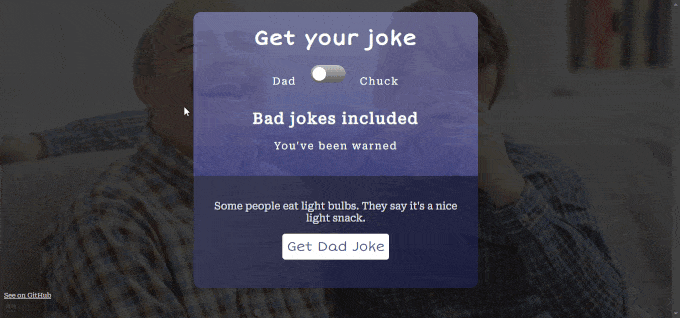

# Dad Norris
## A notorious dad joke and Chuck Norris ~~jokes~~ facts generator

[See website](https://dadnorris.netlify.app/)

## About
Just some practice with APIs. 

Users can select the type of joke (or, ahem, fact) they want to generate through a toggle slider. Background image adjusts automatically as well.

The Chuck Norris jokes API allows the retrieval of a personalized joke from a previously specified category, too, so that gave me the idea for the little Easter Egg.

## Next steps?
- No further implementations predicted.

## APIs/Resources used:
- Chuck Norris jokes: [API Website](https://api.chucknorris.io/)
- Dad jokes: [API Website](https://icanhazdadjoke.com/)